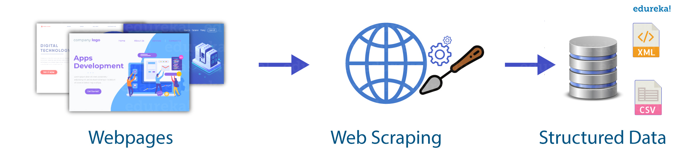
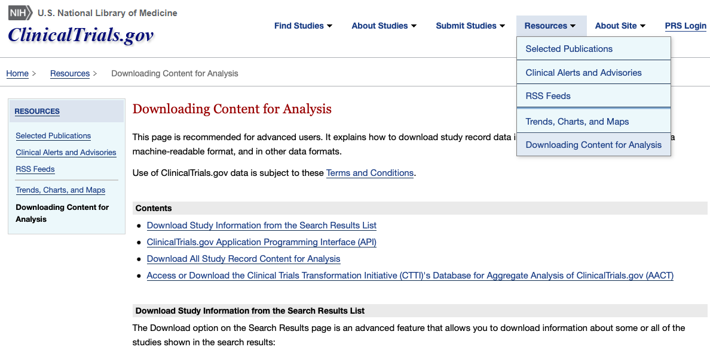
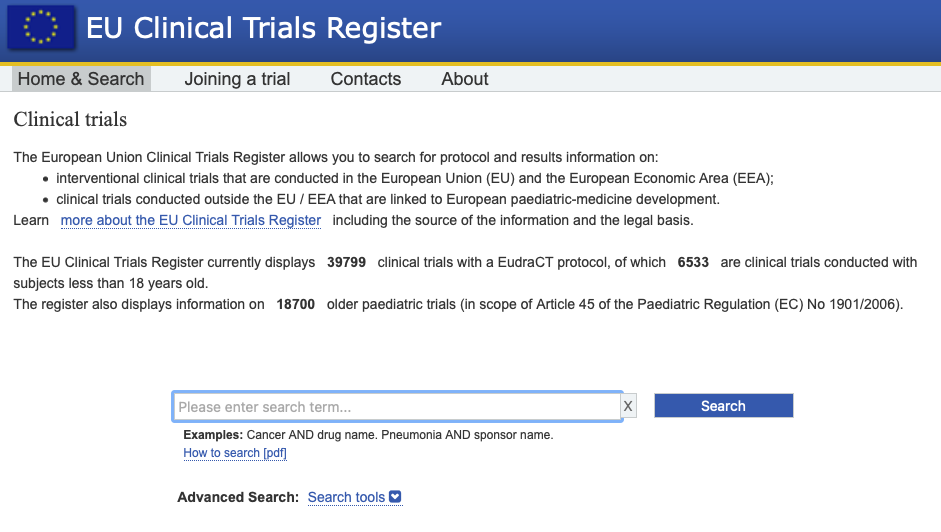
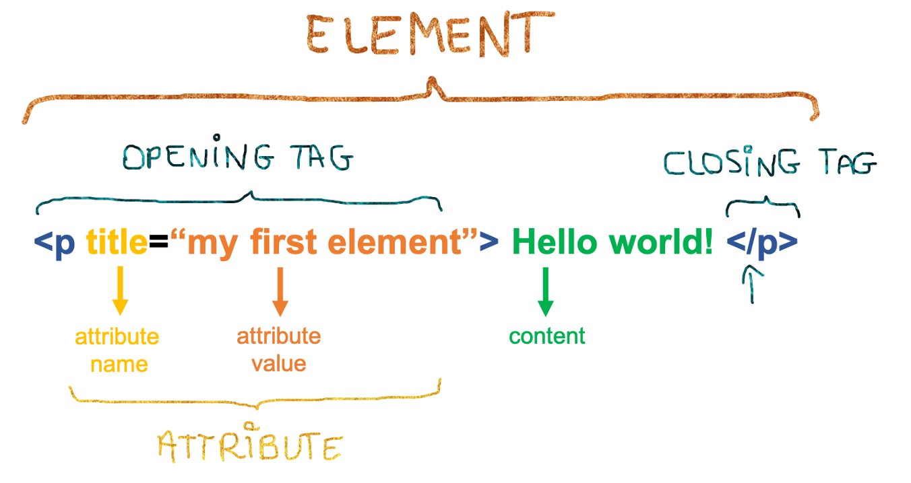
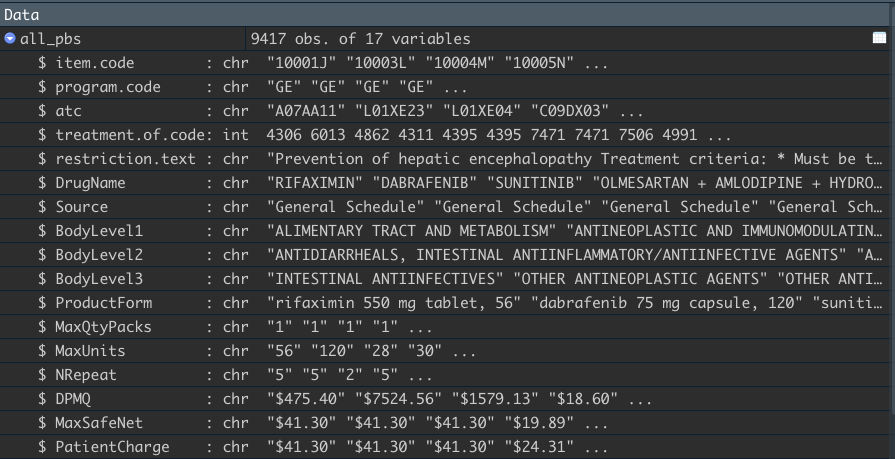

```{r setup, include=FALSE}
knitr::opts_chunk$set(echo = FALSE)
library(rvest) 
library(tidyverse)
library(knitr)
library(kableExtra)
```

## Welcome to fantastic data and where to scrape them  

This workshop is for beginner R users and aims to introduce you to the world of scraping.  
  
  
**Topics covered:**  
  
> 1. What is scraping?  
> 2. Ethical considerations  
> 3. Webpage structures and HTML
> 4. Inspect
> 5. Scraping data in R
> 6. Case study 

## Why do **I** care about scraping? 

Current research project aims at analysing real-world treatment patterns across multiple cancer types.    
  
Victorian-wide linked datasets, comprising cancer registry, hospital admin data, and PBS/MBS data.  
  
Costing of pharmaceuticals and services subsidised by the Australian Government is key but there's no database resources that link drugs/services/cost information, including historical prices.  
  
So we scrape it all and build a database that is used to  
1. find and retrieve drug information within R/excel    
2. link a drug/service item to its current and historical price    
3. facilitate patterns of care analyses    

# 1. S-C-R-A-P-I-N-G-!  

## What is scraping?

The internet is the first place where you look for information and data!   
  
**Web scraping is one of the most robust and reliable ways of getting web data from the internet.**  

<center>  </center>  
    
    
<p>Scraping performs automated information extraction from websites by parsing the page *source code* to retrieve programmatically specified elements.</p>

## Do you really need scraping? {.build}

<p>Remember to choose the easiest tool for the job!

- Can you easily copy and paste data from a site into Excel?
- Is there an export/download feature? 
- Is there an API to extract structured data via R?
  
<center> </center>

## From the web to data

<p> So you need data that's found on a website that you can *only* browse...  </p>
<center>  </center>

# 2. Some ethical considerations

## Think before you scrape {.build}

Consider the following before going ahead with scraping:  

- Is the data *free*? **-->** Terms of use is a good thing to check first.  <br>  
- Are there *restrictions* on what I can do with this data? **-->** Look for any copyright statements.  <br>  
- Is there a risk of *overloading* the website’s server? **-->** Some websites have access rules, check for any ```robots.txt``` files.   <br>  
  
<br>
<p>**!** The polite package can be used for responsible scraping etiquette   
<center>  </center> </p>


# 3. Webpage structures and HTML  

## Websites | (are made of these)

What's in a website?

<p>  
> 1. <u> Structure</u> of content: **H**yper**t**ext **M**arkup **L**anguage   
> 2. <u> Styling</u> of content: **C**ascading **S**tyle**s**heets    
> 3. <u> Adding complex</u> stuff: Javascript   
</p>
<br>
**> If the underlying structure is well organised, then scraping is usually straight forward**

## HTML basics

The basic unit of an HTML document: **element**
```  
- Contains tags: <tag> </tag>
- Contains attributes: <tag attribute="cool" > </tag>   
- Contains content: <tag attribute="cool" > content </tag>
```
<center></center>

## HTML's anatomy

```
        <!DOCTYPE html>
          <html>
            <head>
              <title> must have a title </title>
                container for metadata / CSS
            </head>
          <body>
              container for the  actual content, with various elements:
                for grouping: <div> <span> 
                for heading: <H1> to <H6> 
                for paragraphs: <p> <br>
                for list / table: (<ul> or <ol>) + <li> / <table> + <tr><td>
                attributes to elements: `id` `class` `title` `href`
          </body>
        </html>
```

# 4. Inspect

## Inspecting a website

Most browsers have built-in *inspect* tool that allow you to explore a web page.   

| Inspect Element | Windows | macOS |
|--|:---:|:---:|
| Mozilla | `Ctrl` + `Shift` + `C` | `Cmd` + `Shift` + `C` |
| Chrome | `Ctrl` + `Shift` + `J` | `Cmd` + `Option` + `J` |
| Safari | x | `Cmd` + `Option` + `I` |

<p>Or simply right-click any part of a website and select **Inspect** or **Inspect element**  

Safari users may have to enable the option:  
    `Preferences -> Advanced -> Menu bar -> enable 'Show Developer menu'`
</p>

# 5. Scraping data in R

## rvest for scraping 

```{r}
x <- data.frame(Function = c("read_html()", "html_nodes()", "html_text()", "html_text2()",
                             "html_elements()",
                             "html_table()", "html_name()", "html_attr()", "html_attrs()"), 
                Description = c("read HTML from a character string or URL", 
                                "select specified pieces from the HTML document using CSS selectors", 
                                "extract content", "extract content AND proper parsing of white spaces",
                                "extract the variables from each observation of a specific element",
                                "parse an HTML table into a data frame",
                                "extract tag names", "extract value for a specified attribute name",
                                "extract all attributes and values"))
x %>% 
 kable() %>%
 kable_styling(full_width = F) %>%
 column_spec(2, width = "40em", bold = FALSE) %>%
 column_spec(1, bold = TRUE) %>%
 row_spec(0, color = "white", font_size = 24) %>%
 row_spec(1, color = "black", background = "lightblue", font_size = 22) %>%
 row_spec(2, color = "black", background = "navajowhite", font_size = 22) %>%
 row_spec(3, color = "black", background = "white", font_size = 22) %>%
 row_spec(4, color = "black", background = "lightgrey", font_size = 22) %>%
 row_spec(5, color = "black", background = "white", font_size = 22) %>%
 row_spec(6, color = "black", background = "lightgrey", font_size = 22) %>%
 row_spec(7, color = "black", background = "white", font_size = 22) %>%
 row_spec(8, color = "black", background = "lightgrey", font_size = 22) %>%
 row_spec(9, color = "black", background = "white", font_size = 22) 

```

## CSS selectors

CSS used for <u>styling</u>...  
  
But also include a <u>miniature language</u> for **selecting elements** on a HTML document.  
<center>  </center>
  
**->** Define patterns for locating HTML elements  
  
<h4> **Combining inspecting tool + CSS selectors = provide a path to where the data you want can be extracted!** </h4>

# 6. Case study: scraping the Pharmaceutical Benefits Scheme (PBS)

## The Pharmaceutical Benefits Scheme

[PBS](https://www.pbs.gov.au/pbs/) similar to the British National Formulary  
  
Let's look at the website together:

1. A-Z drugs correspond to different indexes
2. Each index has a list of drugs
3. Each drug link has a list of sub links

## Step 1: collect links

```{r echo=T, results='show'}
## Gather all index links on PBS

url_pbs <- "https://www.pbs.gov.au/browse/medicine-listing?initial="
pages_pbs <- paste0(url_pbs, letters)
head(pages_pbs, 3)
```

## Step 2: Get all links from each index

```{r echo=T, results='show'}
## Get all links from each index (i.e. all drug links)
find_all_links <- function(pages_pbs) {
  res_pbs = c()
  for (link in pages_pbs) {
    tmp <- link %>% read_html %>%
      html_nodes('#medicine-item > tbody > tr:nth-child(n) > td > a') %>% 
      html_attr('href') %>% paste('https://www.pbs.gov.au',.,sep='')
    res_pbs = c(res_pbs, tmp)
  }
  return(res_pbs) }

all_pbs <- find_all_links(pages_pbs)
head(all_pbs, 3)
```

## Step 3: extract the data

**Please, do <u>not</u> run this code during workshop**

```{r echo=T, results='show', eval=FALSE}
## Get all sub-links within one drug link
find_all_sublinks <- function(all_pbs) {
  all_subpbs = c()
  for (link in all_pbs) {
    tryCatch(
      tmp_sub <- link %>% read_html %>%
        html_nodes('#content > div > div > div:nth-child(4) > div > table > 
                   tbody > tr:nth-child(1) > td > ul > li:nth-child(n) > a') %>%
        html_attr('href'), error = function(e){NA} ) 
    all_subpbs = c(all_subpbs, tmp_sub) }
  return(all_subpbs) }

sub_pbs <- find_all_sublinks(all_pbs) %>% paste('https://www.pbs.gov.au',.,sep='') 
head(sub_pbs, 5)
```

## Step 4: retrieve the tables and produce db

**Please, do <u>not</u> run GitHub R code during workshop**
  
> - Parse nodes/columns within main table  

```{r echo=T, results='hide', eval=FALSE}
CSS selector: html_nodes("#medicine-item")
```
> - Scrape first complete row  

```{r echo=T, results='hide', eval=FALSE}
CSS selector: html_nodes("tr:nth-child(2) > td.align-top")
Extraction: html_text()
```
> - Build data frame   

Each node contains a column of interest
One row is one drug item
Merge all rows from all links into one RDS/csv file.

## PBS scraped -- further linked to scraped MBS and historical prices
<center> </center>

## Amazing resources

**Want to learn more?**     
   
[HTML basics](https://developer.mozilla.org/en-US/docs/Learn/Getting_started_with_the_web/HTML_basics) : introduction to web structure @ Mozilla  <br>  
[HTML elements](https://www.w3schools.com/html/html_basic.asp) : complement to the above @ W3Schools <br>  
[Scraping with R](https://rvest.tidyverse.org) : rvest package homepage  <br>  
[Scraping etiquette](https://dmi3kno.github.io/polite/) : polite package homepage <br>   
[CSS selectors](https://www.internetingishard.com/html-and-css/css-selectors/) : CSS selectors @ Interneting is hard  <br>   
[Scraping Javascript](https://cran.r-project.org/web/packages/RSelenium/vignettes/basics.html) : Rselenium when Rvest is not enough  <br>

  